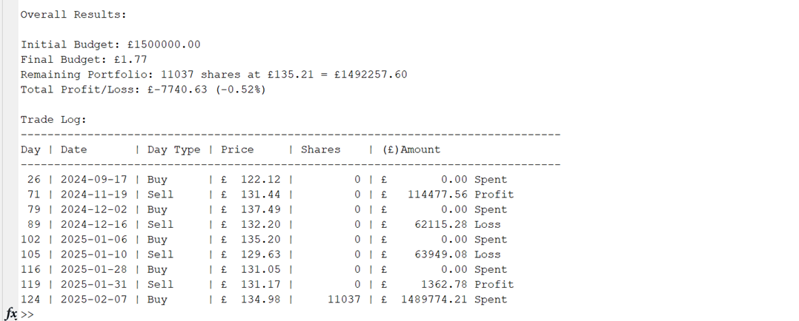
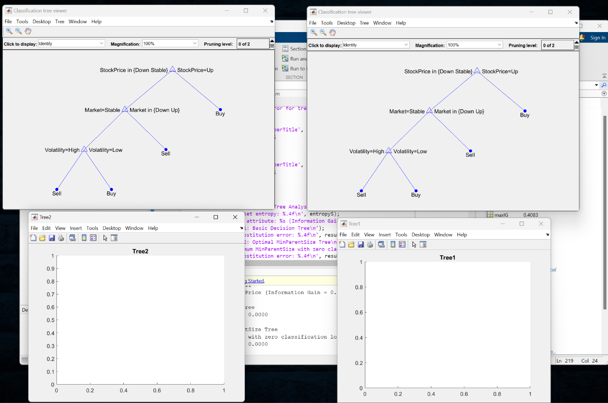

# Algorithmic-Trading-with-Decision-Trees
Computational Models in Economics & Finance Module

This repository contains MATLAB implementations of two computational economics tasks focusing on trading strategies and decision tree analysis for financial markets.

## Project Overview

The project comprises two main components:
1. **Moving Average Trading Strategy** - Automated trading system for ABNB stock
2. **Decision Tree Analysis** - Machine learning approach for trading decisions

## Files

### Task1.m
**Moving Average Trading Strategy for ABNB Stock**

This script implements an automated trading strategy using moving averages with the following features:

- **Data Import**: Reads ABNB stock price data from CSV format
- **Technical Indicators**: Calculates 9-day and 18-day moving averages
- **Trading Logic**: 
  - Buy signal when 9-day MA crosses above 18-day MA
  - Sell signal when 9-day MA crosses below 18-day MA
- **Portfolio Management**: Tracks budget, shares owned, and profit/loss
- **Results**: Generates comprehensive trade log and performance metrics

**Key Parameters:**
- Initial budget: £1,500,000
- Strategy starts after day 18 (to allow moving averages to stabilise)
- Buys maximum shares possible with available budget
- Sells all shares when sell signal triggered

### Task2.m
**Decision Tree Analysis for Trading Decisions**

This script performs decision tree analysis on trading decisions using the following approach:

- **Dataset**: 9 trading scenarios with 4 attributes (Stock Price, Market, Volatility, News)
- **Manual Analysis**: Calculates entropy and information gain for each attribute
- **Automated Trees**: Uses MATLAB's `fitctree` function to generate decision trees
- **Optimisation**: Finds optimal `MinParentSize` parameter for best performance
- **Visualisation**: Generates graphical representations of decision trees

**Features:**
- Entropy-based attribute selection
- Information gain calculation
- Binary search for optimal tree parameters
- Resubstitution error analysis
- Comparative analysis between manual and automated approaches

## Prerequisites

- MATLAB R2019b or later
- Statistics and Machine Learning Toolbox (for `fitctree` function)
- ABNB.csv data file (for Task 1)

## Usage

### Task 1 - Trading Strategy
1. Ensure ABNB.csv is in the same directory as the script
2. Run `Task1.m` in MATLAB
3. View trading results and portfolio performance in command window

### Task 2 - Decision Tree Analysis
1. Run `Task2.m` in MATLAB
2. Examine entropy calculations and information gain values
3. View decision tree visualisations in generated figures
4. Compare manual vs automated tree performance

## Output

### Task 1 Output
- Overall portfolio performance summary
- Detailed trade log with dates, prices, and transactions
- Final profit/loss calculation and percentage return

### Task 2 Output
- Dataset entropy calculation
- Information gain for each attribute
- Decision tree structure description
- Resubstitution errors for different tree configurations
- Graphical decision tree representations

## Educational Value

These scripts demonstrate:
- **Quantitative Finance**: Implementation of technical trading strategies
- **Machine Learning**: Practical application of decision trees in finance
- **Data Analysis**: Processing and analysis of financial time series data
- **Algorithm Implementation**: Manual vs automated approaches to problem solving

## Notes

- Task 1 requires external stock price data (ABNB.csv)
- Task 2 uses embedded dataset for reproducible results
- Both scripts include extensive commenting for educational purposes
- Error handling and data validation included throughout
